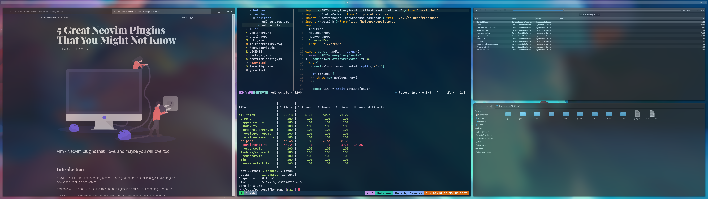
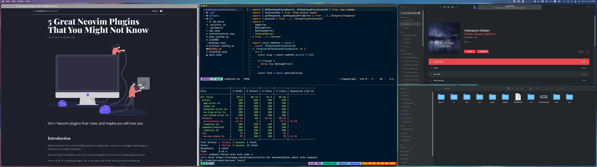

# Environment Configuration

## Manjaro


## macOS


The idea is to make a clean, minimal, and fluid development experience, that is as consistent as possible across Linux and macOS.

To manage the configuration files in this repo I use a combination of [GIT](https://git-scm.com/), to version the changes, and [Stow](https://www.gnu.org/software/stow/), to manage the symbolic links to the configurations.

These configurations were tested on [Manjaro](https://manjaro.org/) and [macOS](https://www.apple.com/de/macos/monterey/), but most of it should be usable in many other Linux distributions.

## How To Use It
Be sure to have [GIT](https://git-scm.com/) and [Stow](https://www.gnu.org/software/stow/) installed.

### 1. Clone the repository
This will clone the repository to your `$HOME` directory and change the repository directory.

```bash
git clone https://github.com/theminimalistdeveloper/dotfiles.git ~/dotfiles
cd ~/dotfiles
```
### 2. Choose the application
Each application has its own directory on the root of the project, choose which one you want to use the configuration.
From root of the project, issue the following command, note that `{application}` refers to the application folder name.
For Neovim, for example, it would be:

```bash
stow nvim
```

## Applications
Follow the link of each application below to have more information about the configuration.

* **[I3](https://github.com/theminimalistdeveloper/dotfiles/tree/main/i3)**: i3 is a tiling window manager, completely written from scratch.
* **[WezTerm](https://github.com/theminimalistdeveloper/dotfiles/tree/main/wezterm)**:WezTerm is a powerful cross-platform terminal emulator and multiplexer written by Wez and implemented in Rust 
* **[Nvim](https://github.com/theminimalistdeveloper/dotfiles/tree/main/nvim)**: Hyperextensible Vim-based text editor.
* **[Picom](https://github.com/theminimalistdeveloper/dotfiles/tree/main/picom)**: Picom is a standalone compositor for Xorg, suitable for use with window managers that do not provide compositing.
* **[Polybar](https://github.com/theminimalistdeveloper/dotfiles/tree/main/polybar)**: A fast and easy-to-use tool for creating status bars.
* **[Rofi](https://github.com/theminimalistdeveloper/dotfiles/tree/main/rofi)**: A window switcher, Application launcher and dmenu replacement.
* **[TMUX](https://github.com/theminimalistdeveloper/dotfiles/tree/main/tmux)**: Tmux is a terminal multiplexer. It lets you switch easily between several programs in one terminal, detach them (they keep running in the background) and reattach them to a different terminal.
* **[ZSH](https://github.com/theminimalistdeveloper/dotfiles/tree/main/zsh)**: Zsh is a shell designed for interactive use, although it is also a powerful scripting language.
