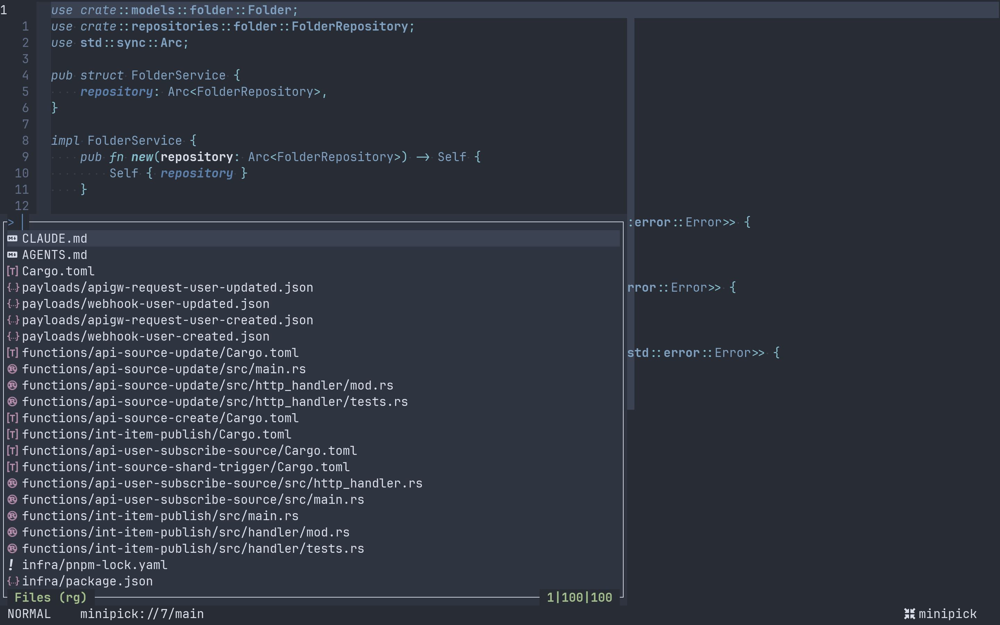

# [Neovim](https://neovim.io)



"Neovim is a refactor, and sometimes redactor, in the tradition of Vim (which itself derives from Stevie). It is not a rewrite but a continuation and extension of Vim. Many clones and derivatives exist, some very clever—but none are Vim. Neovim is built for users who want the good parts of Vim, and more."

## Overview

* Modern Neovim configuration focused on **JavaScript, TypeScript, and Rust** development
* Minimal, modular architecture with automatic plugin loading
* Built on Neovim's native LSP and package manager
* **Not** compatible with Vim
* Requires **Neovim 0.10+** for native package management

## Configuration Structure

The configuration follows a modular architecture written entirely in [Lua](http://www.lua.org/):

```
.config/nvim/
├── init.lua           # Entry point
├── lua/
│   ├── settings.lua   # Editor settings (tabs, search, undo, etc.)
│   ├── mappings.lua   # Keybindings (<Space> as leader)
│   ├── ui.lua         # Visual settings (colorscheme, statusline)
│   ├── signs.lua      # UI signs configuration
│   ├── lsp-list.lua   # Enabled LSP servers
│   ├── plugins/
│   │   ├── init.lua   # Auto-loads all plugin configs
│   │   ├── mini-*.lua # Mini.nvim modules
│   │   ├── nvim-tree.lua
│   │   ├── neogit.lua
│   │   └── ...        # One file per plugin
│   └── lsp/
│       ├── init.lua   # Auto-loads all LSP configs
│       ├── vtsls.lua  # TypeScript/JavaScript
│       ├── rust-analyzer.lua
│       └── ...        # One file per LSP server
```

### Key Files

* **[init.lua](.config/nvim/init.lua)** - Loads configuration modules in order
* **[settings.lua](.config/nvim/lua/settings.lua)** - Editor behavior and preferences
* **[mappings.lua](.config/nvim/lua/mappings.lua)** - All custom keybindings
* **[ui.lua](.config/nvim/lua/ui.lua)** - Visual appearance (Nord theme, transparent background)
* **[lsp/init.lua](.config/nvim/lua/lsp/init.lua)** - LSP configuration and auto-formatting
* **[plugins/init.lua](.config/nvim/lua/plugins/init.lua)** - Plugin auto-loader

## Plugin Management

This configuration uses **Neovim's native package manager** via `vim.pack.add()`. No external plugin manager required.

### Adding a New Plugin

1. Create a new file in `.config/nvim/lua/plugins/<plugin-name>.lua`
2. Add the plugin configuration:

```lua
vim.pack.add({'https://github.com/author/plugin-name'})
require('plugin-name').setup({
  -- your configuration
})
```

3. Restart Neovim - the plugin will be automatically loaded

## Language Server Setup

LSP servers are managed through [Mason](https://github.com/williamboman/mason.nvim) and configured individually.

### Supported Languages

* **JavaScript/TypeScript** - vtsls
* **Rust** - rust-analyzer
* **Lua** - lua_ls
* **CSS** - cssls
* **JSON** - jsonls
* **YAML** - yamlls
* **TOML** - taplo
* **Bash** - bashls
* **Docker Compose** - docker_compose_language_service
* **GraphQL** - graphql
* **TailwindCSS** - tailwindcss
* **HTML** - html
* **Biome** - biome (formatter/linter)

### Adding a New LSP Server

1. Add server name to `.config/nvim/lua/lsp-list.lua`
2. Create `.config/nvim/lua/lsp/<server-name>.lua`:

```lua
vim.lsp.config['server_name'] = {
  cmd = { 'server-binary', '--stdio' },
  root_markers = { 'package.json', '.git' },
  filetypes = { 'javascript', 'typescript' },
  settings = { },
}
```

3. Mason will auto-install the server on next Neovim start

## Key Features

### Core Plugins

* **[mini.nvim](https://github.com/echasnovski/mini.nvim)** - Comprehensive plugin library
  * mini.pick - Fuzzy finder
  * mini.completion - Auto-completion
  * mini.statusline - Status bar
  * mini.clue - Keybinding hints
  * mini.git - Git integration
  * mini.diff - Diff viewer
  * mini.snippets - Snippet engine
  * mini.pairs - Auto-pairs
  * mini.surround - Surround text objects
  * mini.move - Move lines/selections
  * mini.comment - Smart commenting
  * mini.notify - Notifications

* **[nvim-treesitter](https://github.com/nvim-treesitter/nvim-treesitter)** - Advanced syntax highlighting
* **[nvim-tree.lua](https://github.com/nvim-tree/nvim-tree.lua)** - File explorer
* **[neogit](https://github.com/NeogitOrg/neogit)** - Git client
* **[trouble.nvim](https://github.com/folke/trouble.nvim)** - Diagnostics panel
* **[copilot.vim](https://github.com/github/copilot.vim)** - GitHub Copilot integration
* **[vim-tmux-navigator](https://github.com/christoomey/vim-tmux-navigator)** - Seamless tmux/vim navigation
* **[diffview.nvim](https://github.com/sindrets/diffview.nvim)** - Git diff viewer
* **[fidget.nvim](https://github.com/j-hui/fidget.nvim)** - LSP progress notifications

### Keybindings

Leader key: `<Space>`

**File Navigation:**
* `<Space>ff` - Find files
* `<Space>fg` - Live grep
* `<Space>fb` - Find buffers

**LSP:**
* `<Space>lr` - Rename symbol
* `<Space>ld` - Go to definition
* `<Space>lh` - Hover documentation
* `<Space>li` - Go to implementation
* `<Space>le` - Show references
* `<Space>lf` - Format file
* `<Space>ln` - Next diagnostic
* `<Space>lp` - Previous diagnostic

**Buffers:**
* `<Space>bn` - Next buffer
* `<Space>bp` - Previous buffer
* `<Space>bd` - Delete buffer

**Windows:**
* `<Space>ws` - Split horizontally
* `<Space>wv` - Split vertically
* `<Space>wq` - Close window

See [mappings.lua](.config/nvim/lua/mappings.lua) for complete list.

### Auto-formatting

Format-on-save enabled for: `.rs`, `.js`, `.jsx`, `.ts`, `.tsx`

Configure in [lsp/init.lua](.config/nvim/lua/lsp/init.lua)

## Installation

1. **Install Neovim 0.10+**
   ```bash
   # See: https://github.com/neovim/neovim/wiki/Installing-Neovim
   ```

2. **Clone this configuration**
   ```bash
   # Symlink or copy .config/nvim to your config location
   ```

3. **Install dependencies**
   * [JetBrains Mono Nerd Font](https://www.nerdfonts.com/) (for icons)
   * [ripgrep](https://github.com/BurntSushi/ripgrep) (for live grep)
   * [Node.js](https://nodejs.org/) (for many LSP servers)
   * [Rust](https://rustup.rs/) (for Rust development)

4. **Launch Neovim**
   ```bash
   nvim
   ```
   Plugins and LSP servers will be automatically installed via Mason.

## Customization

* **Theme**: Edit `vim.cmd 'colorscheme nord'` in [ui.lua](.config/nvim/lua/ui.lua)
* **Keybindings**: Modify [mappings.lua](.config/nvim/lua/mappings.lua)
* **LSP servers**: Add/remove in [lsp-list.lua](.config/nvim/lua/lsp-list.lua)
* **Editor settings**: Adjust [settings.lua](.config/nvim/lua/settings.lua)
