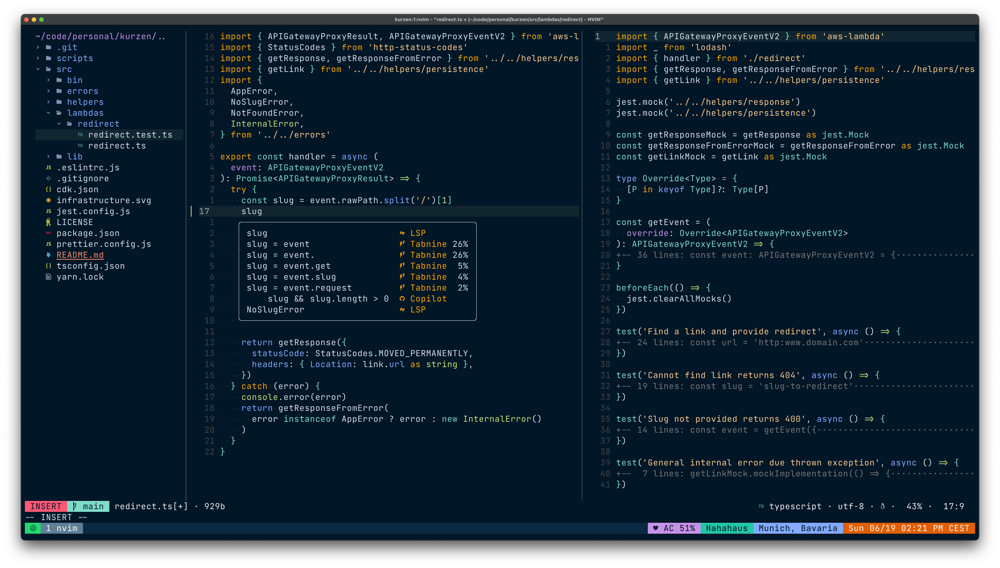

# Neovim



"Neovim is a refactor, and sometimes redactor, in the tradition of Vim (which itself derives from Stevie). It is not a rewrite but a continuation and extension of Vim. Many clones and derivatives exist, some very clever—but none are Vim. Neovim is built for users who want the good parts of Vim, and more."
You can find more information about it [here](https://neovim.io)

## What is this setup about?
* This setup is mainly focused on editing Javascript, Typescript, and Rust, but could easily be extended to another languages.
* This setup is **not** compatible with VIM.
* This setup requires Neovim 0.6 or greater.

## Configuration

The configuration is all written in [lua](http://www.lua.org/) and is organized in the following parts:

* **[lsp.lua](https://github.com/theminimalistdeveloper/dotfiles/blob/master/nvim/.config/nvim/lua/lsp.lua)** - Neovim native LSP configuration.
* **[lualine-theme.lua](https://github.com/theminimalistdeveloper/dotfiles/blob/master/nvim/.config/nvim/lua/lualine-theme.lua)** - Lualine theme
* **[mappings.lua](https://github.com/theminimalistdeveloper/dotfiles/blob/master/nvim/.config/nvim/lua/mappings.lua)** - All custom mappings.
* **[plugins.lua](https://github.com/theminimalistdeveloper/dotfiles/blob/master/nvim/.config/nvim/lua/plugins.lua)** - All plugins configuration and setup.
* **[settings.lua](https://github.com/theminimalistdeveloper/dotfiles/blob/master/nvim/.config/nvim/lua/settings.lua)** - General settings of the editor like line numbers, backup files, undo levels, etc.
* **[signs.lua](https://github.com/theminimalistdeveloper/dotfiles/blob/master/nvim/.config/nvim/lua/settings.lua)** - List of signs used in the interface
* **[ui](https://github.com/theminimalistdeveloper/dotfiles/blob/master/nvim/.config/nvim/lua/ui.lua)** - All configuration regarding the visual aspect of the editor like colorschemes, error colors, symbols, overall appearance.

## Installation

All information can be found [here](https://github.com/neovim/neovim/wiki/Installing-Neovim), just remember to install with Python support, to be able to use [Ultisnips](https://github.com/SirVer/ultisnips), and some other plugins .

## Plugins

### Plugins Manager

In this configuration, I used [Packer](https://github.com/wbthomason/packer.nvim) plugin manager.

### Running

For the first time use this command to install all necessary plugins:
```bash
:PackerInstall
```
# External Dependencies

* [ESLint](https://eslint.org/docs/user-guide/getting-started)
* [Prettier](https://prettier.io/)
* [RLS](https://github.com/rust-lang/rls)

# Other tools & Resources

* [JetBrains Mono](https://www.jetbrains.com/lp/mono/): JetBrains open source monospaced fonts for developers.
